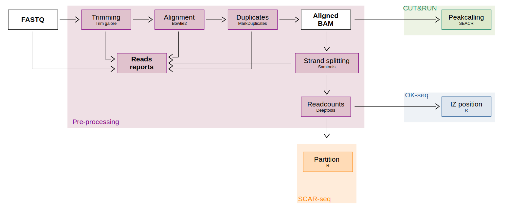

# SCAR-seq and OK-seq pipeline

This pipeline is built to analyse CUT&RUN, SCAR-seq and OK-seq data coming from replication forks.

It is divide in 4 parts : pre-processing, SCAR-seq, OK-seq and CUT&RUN with pre-processing part which is common to all analysis.

FASTQ or aligned BAM files are take as input.



You can find the details pipeline steps and rule in `images` folder.

## How to run the pipeline

### Installation

The pipeline is already install in the Gustave Roussy cluster here : `/home/m_coulee/DNA_fork_pipeline`.
You can install it in your personal folder using git command :

```sh
git clone https://github.com/ManonCoulee/DNA_fork_pipeline.git
```

### Preparation

To run this pipeline you need to generate two files:

**1. Configuration file**

This file is used to changed your parameters in the differents tools as quality score, read length. You can defind the output directory (`output_dir`) where will be localised the results.

The part `references` able to defined the genome reference and files necessaaryt to generated the pipeline.

It's possible to modulated the pipeline according to three different ways. To do that, you can change the option in `steps` part in the file.
- **cutrun** : classical way to process peakcalling for CUT&RUN data
- **scarseq** : calculated the partion of reverse and forward strand (mandatory for SCAR-seq data)
- **okseq** : calculated RFD score and estimated the IZ position (mandatory for OK-seq data)

You can copy/paste and modify the model config file which already exist: [**PIPELINE_config.yaml**](./PIPELINE_config.yaml).

**2. Design file**

This file contains informations about the sample that you want to study. You can find an exemple in [**PIPELINE_design.csv**](./PIPELINE_design.csv). The column's name are sample_id, path_file and cell_id and are separate with comma field. 
*sample_id* contains the name of the sample, this name are use to name all file which will be created, *path_file* the path of your data and *cell_id* contains the type of data (for IgG data your need to call them as "input").

If you have IgG input file, put them in design file in same order than sample associated. In case of one input corresponding to many sample, put it same time than the number of sample and in same order.

<ins>Exemple:</ins> exemple of design file with multiple input.
```
sample_id,path_file,cell_id,
E14_R1,<path_to_your_sample>,E14
E14_R2,<path_to_your_sample>,E14
P9_R1,<path_to_your_sample>,E14
E14_IgG,<path_to_your_sample>,input
E14_IgG,<path_to_your_sample>,input
P9_IgG,<path_to_your_sample>,input
```

### Run the pipeline (on Gustave Roussy plateform)

This pipeline not required GPU, so it recommanded to run it in `/mnt/beegfs01/scratch/<your_name>`.
All data that you want to analyse/aligned need to be copy in your analysis folder (same folder than the one you use as output in your config file).

You can do it following these command lines:

```sh
# Access to your personal folder
cd /mnt/beegfs01/scratch/<your_name>

# Create your analysis folder and acceder to it
mkdir <your_analysis_folder>
cd <your_analysis_folder>

# Copy your interest data from NAS to your analysis folder 
cp /mnt/glustergv0/UMR9019/PETRYK/<path_of_your_data_to_copy>
```

To run the pipeline you need to created a bash script (*script.sh*) to call snakemake.

<ins>Exemple:</ins> exemple of script which will called with sbatch

```sh
#!/bin/bash
#using sbatch run.sh
#SBATCH --job-name=SCARseq
#SBATCH --nodes=1
#SBATCH --cpus-per-task=1
#SBATCH --mem=1G
#SBATCH --partition=longq

source /mnt/beegfs02/software/recherche/miniconda/25.1.1/etc/profile.d/conda.sh
conda activate  /mnt/beegfs02/pipelines/bigr_rna_editing/1.1.1/envs/compiled_conda/snakemake

pipeline="/home/m_coulee/DNA_fork_pipeline"

snakemake --profile ${pipeline}/profiles/slurm \
	-s ${pipeline}/Snakefile \
	--configfile <path_to_your_configuration_file>
```
It is possible to copy/paste [**PIPELINE_script.sh**](./PIPELINE_script.sh) and modify the path of configuration file.

Once your script are create you run it with ```sbatch PIPELINE_script.sh``` command from your directory.

## Pipeline tools description

|**Tools**|**Steps**|**Description**|**Reference**|
|-----|-----|-----|-----|
|Fastqc|Pre-processing|Quality control of FASTQ. Return a HTML report in Quality_Control folder|[Broad Institute, 2019](https://broadinstitute.github.io/picard/)|
|Cutadapt|Pre-processing|Remove adaptater and filtered read according to quality and length|[Martin et al, 2011](https://doi.org/10.14806/ej.17.1.200)|
|Bowtie2|Pre-processing|Align reads against the genome|[Langmead et Salzberg, 2012](https://doi.org/10.1038/nmeth.1923)|
|MarkDuplicates|Pre-processing|Marked the duplicated reads and remove them|[Broad Institute, 2019](https://broadinstitute.github.io/picard/)|
|SAMtools|Pre-processing|Indexation of bam, separation according strand|[Li et al, 2009](https://doi.org/10.1093/bioinformatics/btp352)|
|Deeptools|Pre-processing|Calculated the coverage of forward and reverse strand in bins of 1kb|[Ramirez et al, 2016](https://doi.org/10.1093/nar/gkw257)|
|SEACR|CUT&RUN|Peak calling specialised in CUT&RUN data. Results are find in SEACR folder|[Meers et al, 2019](https://doi.org/10.1186/s13072-019-0287-4)|
|OKseqHMM|OK-seq|Calculated the ratio (RFD) between two strands and determine the IZ and TZ score using HMM model. Results can be find in OKseqHMM folder|[Liu et al, 2023](https://doi.org/10.1093/nar/gkac1239)|
