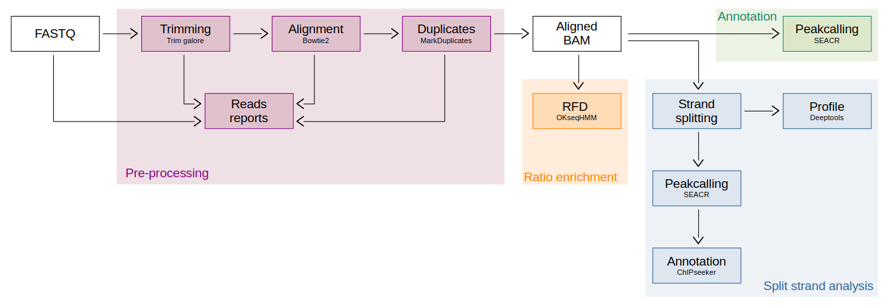

# CUT&RUN pipeline

This pipeline is built to analyse CUT&RUN data from replication forks. It can perform pre-processing, alignment and annotation.

FASTQ or aligned BAM files are take as input.



## How to run the pipeline

The pipeline is already install in the Gustave Roussy cluster.
It is localised in `/home/m_coulee/Post-doc/H3K9me3_pipeline`. 

### Preparation

To run this pipeline you need to generate two files:

**1. Configuration file**

This file is used to changed your parameters in the differents tools as quality score, read length, .... You can defind the output directory where will be localised the results.

It's possible to modulated the pipeline according to three different ways. To do that, you can change the option in `steps` part in the file.
- **annotation** : classical way to process peakcalling
- **split_strand_analysis** : separated bam according to strand and process peakcalling
- **ratio_enrichment** : calculated RFD score (mandatory for OKseq)

You can copy/paste and modify the model config file which already exist: [**CUTRUN_config.yaml**](./CUTRUN_config.yaml).

**2. Design file**

This file contains informations about the sample that you want to study. You can find an exemple in [**CUTRUN_design.csv**](./CUTRUN_design.csv). The column's name are sample_id, path_file and cell_id and are separate with comma field. 
*sample_id* contains the name of the sample, this name are use to name all file which will be created, *path_file* the path of your data and *cell_id* contains the type of data (for IgG data your need to call them as "input").

If you have IgG input file, put them in design file in same order than sample associated. In case of one input corresponding to many sample, put it same time than the number of sample and in same order.

<ins>Exemple:</ins> exemple of design file with multiple input.
```
sample_id,path_file,cell_id,
E14_R1,<path_to_your_sample>,E14
E14_R2,<path_to_your_sample>,E14
P9_R1,<path_to_your_sample>,E14
E14_IgG,<path_to_your_sample>,input
E14_IgG,<path_to_your_sample>,input
P9_IgG,<path_to_your_sample>,input
```

### Run the pipeline

This pipeline not required GPU, so it recommanded to run it in `/mnt/beegfs01/scratch/<your_name>`.
All data that you want to analyse need to be put in your analysis folder (same than folder you use as output in your config file).
To

```sh
# Access to your personal folder
cd /mnt/beegfs01/scratch/<your_name>

# Create your analysis folder and acceder to it
mkdir <your_analysis_folder>
cd <your_analysis_folder>

# Copy your interest data from NAS to your analysis folder 
cp /mnt/glustergv0/UMR9019/PETRYK/<your_data_to_copy> .

```

To run the pipeline you need to created a bash script (*script.sh*) to call snakemake.

<ins>Exemple:</ins> exemple of script which will called with sbatch

```sh
#!/bin/bash
#using sbatch run.sh
#SBATCH --job-name=CUTRUN_H3K9me3
#SBATCH --nodes=1
#SBATCH --cpus-per-task=1
#SBATCH --mem=1G
#SBATCH --partition=longq

source /mnt/beegfs02/software/recherche/miniconda/25.1.1/etc/profile.d/conda.sh
conda activate  /mnt/beegfs02/pipelines/bigr_rna_editing/1.1.1/envs/compiled_conda/snakemake

pipeline="/home/m_coulee/Post-doc/H3K9me3_pipeline"

snakemake --profile ${pipeline}/profiles/slurm \
	-s ${pipeline}/Snakefile \
	--configfile <path_to_your_configuration_file>
```
It is possible to copy/paste [**CUTRUN_script.sh**](./CUTRUN_script.sh) and modify the path of configuration file.

Once your script are create you run it with ```sbatch <my_script>.sh``` command from beegfs01 directory.

## Pipeline tools description

|**Tools**|**Steps**|**Description**|
|-----|-----|-----|
|Fastqc|Pre-processing|Quality control of FASTQ. Return a HTML report in Quality_Control folder|
|Trim galore|Pre-processing|Remove adaptater and filtered read according to quality and length|
|Bowtie2|Pre-processing|Realise the alignment against genome|
|MarDuplicates|Pre-processing|Marked the duplicated reads and remove them|
|Samtools|Pre-processing & Strand split analysis|Indexation of bam, separation according strand|
|SEACR|Annotation & Strand split analysis|Peak calling specialised in CUT&RUN data. Results are find in SEACR folder|
|OKseqHMM|Ratio enrichment|Calculated the ratio (RFD) between two strands|